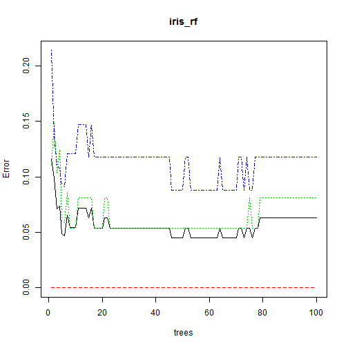
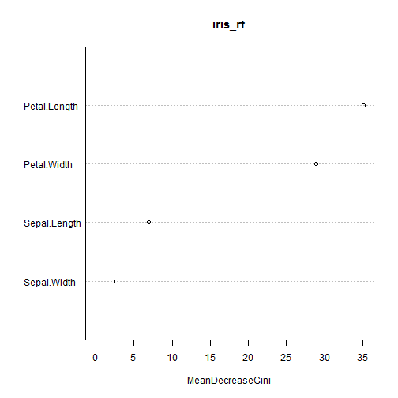
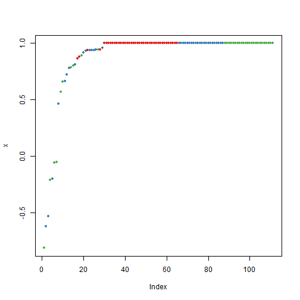
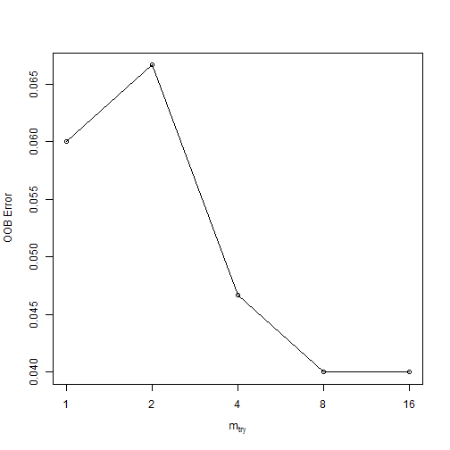

Random Forest in R example with IRIS Data
========================================================


#Random Forest in R example IRIS data


#Split iris data to Training data and testing data


```r
ind <- sample(2,nrow(iris),replace=TRUE,prob=c(0.7,0.3))
trainData <- iris[ind==1,]
testData <- iris[ind==2,]
```
#Load Library Random FOrest

```r
library(randomForest)
```

```
## randomForest 4.6-7
## Type rfNews() to see new features/changes/bug fixes.
```
#Generate Random Forest learning treee

```r
iris_rf <- randomForest(Species~.,data=trainData,ntree=100,proximity=TRUE)
table(predict(iris_rf),trainData$Species)
```

```
##             
##              setosa versicolor virginica
##   setosa         31          0         0
##   versicolor      0         36         4
##   virginica       0          3        34
```

Try to print Random Forest model and see the importance features

```r
print(iris_rf)
```

```
## 
## Call:
##  randomForest(formula = Species ~ ., data = trainData, ntree = 100,      proximity = TRUE) 
##                Type of random forest: classification
##                      Number of trees: 100
## No. of variables tried at each split: 2
## 
##         OOB estimate of  error rate: 6.48%
## Confusion matrix:
##            setosa versicolor virginica class.error
## setosa         31          0         0     0.00000
## versicolor      0         36         3     0.07692
## virginica       0          4        34     0.10526
```

```r
plot(iris_rf)
```

 

```r
importance(iris_rf)
```

```
##              MeanDecreaseGini
## Sepal.Length            6.805
## Sepal.Width             2.608
## Petal.Length           34.951
## Petal.Width            26.511
```

```r
varImpPlot(iris_rf)
```

 

#Try to build random forest for testing data

```r
irisPred<-predict(iris_rf,newdata=testData)
table(irisPred, testData$Species)
```

```
##             
## irisPred     setosa versicolor virginica
##   setosa         19          0         0
##   versicolor      0         11         1
##   virginica       0          0        11
```
Try to see the margin, positive or negative, if positif it means correct classification

```r
plot(margin(iris_rf,testData$Species))
```

```
## Loading required package: RColorBrewer
```

```
## Warning: package 'RColorBrewer' was built under R version 3.1.1
```

 

Try to tune Random Forest

```r
tune.rf <- tuneRF(iris[,-5],iris[,5], stepFactor=0.5)
```

```
## mtry = 2  OOB error = 6.67% 
## Searching left ...
## mtry = 4 	OOB error = 4.67% 
## 0.3 0.05
```

```
## Warning: invalid mtry: reset to within valid range
```

```
## mtry = 8 	OOB error = 4% 
## 0.1429 0.05
```

```
## Warning: invalid mtry: reset to within valid range
```

```
## mtry = 16 	OOB error = 4% 
## 0 0.05 
## Searching right ...
## mtry = 1 	OOB error = 6% 
## -0.5 0.05
```

 

```r
print(tune.rf)
```

```
##        mtry OOBError
## 1.OOB     1  0.06000
## 2.OOB     2  0.06667
## 4.OOB     4  0.04667
## 8.OOB     8  0.04000
## 16.OOB   16  0.04000
```
