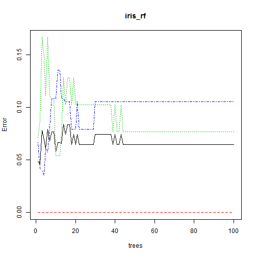
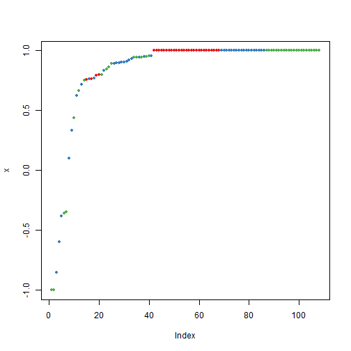

Random Forest in R example with IRIS Data
========================================================


#Random Forest in R example IRIS data


#Split iris data to Training data and testing data


```r
ind <- sample(2,nrow(iris),replace=TRUE,prob=c(0.7,0.3))
trainData <- iris[ind==1,]
testData <- iris[ind==2,]
```
#Load Library Random FOrest

```r
library(randomForest)
```

```
## randomForest 4.6-7
## Type rfNews() to see new features/changes/bug fixes.
```
#Generate Random Forest learning treee

```r
iris_rf <- randomForest(Species~.,data=trainData,ntree=100,proximity=TRUE)
table(predict(iris_rf),trainData$Species)
```

```
##             
##              setosa versicolor virginica
##   setosa         40          0         0
##   versicolor      0         34         4
##   virginica       0          3        30
```

Try to print Random Forest model and see the importance features

```r
print(iris_rf)
```

```
## 
## Call:
##  randomForest(formula = Species ~ ., data = trainData, ntree = 100,      proximity = TRUE) 
##                Type of random forest: classification
##                      Number of trees: 100
## No. of variables tried at each split: 2
## 
##         OOB estimate of  error rate: 6.31%
## Confusion matrix:
##            setosa versicolor virginica class.error
## setosa         40          0         0     0.00000
## versicolor      0         34         3     0.08108
## virginica       0          4        30     0.11765
```

```r
plot(iris_rf)
```

 

```r
importance(iris_rf)
```

```
##              MeanDecreaseGini
## Sepal.Length            6.905
## Sepal.Width             2.193
## Petal.Length           35.081
## Petal.Width            28.867
```

```r
varImpPlot(iris_rf)
```

 

#Try to build random forest for testing data

```r
irisPred<-predict(iris_rf,newdata=testData)
table(irisPred, testData$Species)
```

```
##             
## irisPred     setosa versicolor virginica
##   setosa         10          0         0
##   versicolor      0         13         2
##   virginica       0          0        14
```
Try to see the margin, positive or negative, if positif it means correct classification

```r
plot(margin(iris_rf,testData$Species))
```

```
## Loading required package: RColorBrewer
```

```
## Warning: package 'RColorBrewer' was built under R version 3.1.1
```

 
