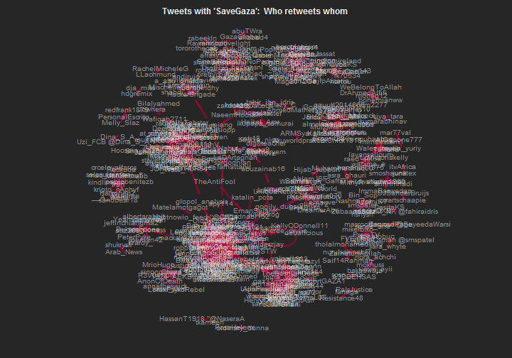

Retweet Graph in R  | Twitter Mining in R
========================================================


#Retweet Graph in R 

# load packages

```r
library(twitteR)
```

```
## Loading required package: ROAuth
## Loading required package: RCurl
## Loading required package: bitops
## Loading required package: digest
## Loading required package: rjson
```

```r
library(igraph)
library(stringr)
```
#Setup your twitter account 

see -> http://rischanlab.github.io/twitteR.html 

After you setup your twitter account just try to get data with contain "SaveGaza". But in this document I save the data first, because If I direct setup my twitter account in this document, knitr not supported because we have to input some code when we try to hand sake to Twitter API. please read the guide in link above to set up your twitter account in R. if you have error message "unautorized" Try to change the permission in your twitter application to "Read, write, and Direct Message"


```r
#dm_tweets = searchTwitter("SaveGaza", n=500, lang="en",cainfo="cacert.pem") 
setwd("C:/Users/rischan/Dropbox/RESEARCH/rischanlab.github.io")
load("dm_tweets.Rdata")
head(dm_tweets,10)
```

```
## [[1]]
## [1] "bham_mz: @AbedaDocrat #CapeTown  #SAMarchForGaza #FreedomForPalestine #SaveGaza http://t.co/6mcKScccib"
## 
## [[2]]
## [1] "ahmedraei81: #GazaNeedsLOVE #GazaUnderAttack #ICC4Israel #ISupportGaza #FreePalestine #SaveGaza http://t.co/T1NxIbVoMP"
## 
## [[3]]
## [1] "Mgeze98: Ya Allah, protect Gaza and it's helpless civilians. 😭#SaveGaza #FreePalestine"
## 
## [[4]]
## [1] "LadyLayaa: Israeli warplanes kill more Palestinians in #Gaza #Palestine #SaveGaza #GazaUnderAttack\nhttp://t.co/bQEJRN0AKf http://t.co/M9CX07kCEy"
## 
## [[5]]
## [1] "FShiyaz: RT @rightnowio_feed: An Israeli protester holds a placard  against Israel's act... http://t.co/8ExDeGoDFQ #Sosgaza #Icc4israel #Savegaza #G…"
## 
## [[6]]
## [1] "Right2LeftUK: RT @mina_ysf: 3 were killed after Israel bombed a mosque before early morning prayers (retrieving their bodies) #SaveGaza http://t.co/OmJUl…"
## 
## [[7]]
## [1] "Samir_Latif: RT @DrBasselAbuward: Children of #Gaza VS Children of The World \n#ISupportGaza #prayforgaza #FreePalestine #SaveGaza #GazaUnderAttack http:…"
## 
## [[8]]
## [1] "redfrank1879: RT @PersonalEscrito: ‘Israel deliberately attacks #Gaza medics’ http://t.co/7h5bWGESN4 #ICC4Israel #IsraelIsAWarCriminal #BoycottIsrael #Fr…"
## 
## [[9]]
## [1] "jean_coonan: RT @rightnowio_feed: RT @mina_ysf: Human Rights Watch: Deliberately attacking... http://t.co/8ExDeGoDFQ #Sosgaza #Icc4israel #Savegaza #Gaz…"
## 
## [[10]]
## [1] "layansalloum: RT @raed_selmi: This pic via @wacima_e \nMy friend in London \n#FreePalestine\n#SaveGaza\n#AJAGAZA http://t.co/uJshneT5fO"
```
# Try to show the data 

```r
head(dm_tweets,10)
```

```
## [[1]]
## [1] "bham_mz: @AbedaDocrat #CapeTown  #SAMarchForGaza #FreedomForPalestine #SaveGaza http://t.co/6mcKScccib"
## 
## [[2]]
## [1] "ahmedraei81: #GazaNeedsLOVE #GazaUnderAttack #ICC4Israel #ISupportGaza #FreePalestine #SaveGaza http://t.co/T1NxIbVoMP"
## 
## [[3]]
## [1] "Mgeze98: Ya Allah, protect Gaza and it's helpless civilians. 😭#SaveGaza #FreePalestine"
## 
## [[4]]
## [1] "LadyLayaa: Israeli warplanes kill more Palestinians in #Gaza #Palestine #SaveGaza #GazaUnderAttack\nhttp://t.co/bQEJRN0AKf http://t.co/M9CX07kCEy"
## 
## [[5]]
## [1] "FShiyaz: RT @rightnowio_feed: An Israeli protester holds a placard  against Israel's act... http://t.co/8ExDeGoDFQ #Sosgaza #Icc4israel #Savegaza #G…"
## 
## [[6]]
## [1] "Right2LeftUK: RT @mina_ysf: 3 were killed after Israel bombed a mosque before early morning prayers (retrieving their bodies) #SaveGaza http://t.co/OmJUl…"
## 
## [[7]]
## [1] "Samir_Latif: RT @DrBasselAbuward: Children of #Gaza VS Children of The World \n#ISupportGaza #prayforgaza #FreePalestine #SaveGaza #GazaUnderAttack http:…"
## 
## [[8]]
## [1] "redfrank1879: RT @PersonalEscrito: ‘Israel deliberately attacks #Gaza medics’ http://t.co/7h5bWGESN4 #ICC4Israel #IsraelIsAWarCriminal #BoycottIsrael #Fr…"
## 
## [[9]]
## [1] "jean_coonan: RT @rightnowio_feed: RT @mina_ysf: Human Rights Watch: Deliberately attacking... http://t.co/8ExDeGoDFQ #Sosgaza #Icc4israel #Savegaza #Gaz…"
## 
## [[10]]
## [1] "layansalloum: RT @raed_selmi: This pic via @wacima_e \nMy friend in London \n#FreePalestine\n#SaveGaza\n#AJAGAZA http://t.co/uJshneT5fO"
```
# get text

```r
dm_txt = sapply(dm_tweets, function(x) x$getText())
```
#processing and Identify the retweet data
# regular expressions to find retweets

```r
grep("(RT|via)((?:\\b\\W*@\\w+)+)", dm_tweets, 
     ignore.case=TRUE, value=TRUE)
```

```
## character(0)
```
# which tweets are retweets

```r
rt_patterns = grep("(RT|via)((?:\\b\\W*@\\w+)+)", 
                   dm_txt, ignore.case=TRUE)
```
# show retweets (these are the ones we want to focus on)

```r
head(dm_txt[rt_patterns],10)
```

```
##  [1] "RT @rightnowio_feed: An Israeli protester holds a placard  against Israel's act... http://t.co/8ExDeGoDFQ #Sosgaza #Icc4israel #Savegaza #G…"    
##  [2] "RT @mina_ysf: 3 were killed after Israel bombed a mosque before early morning prayers (retrieving their bodies) #SaveGaza http://t.co/OmJUl…"    
##  [3] "RT @DrBasselAbuward: Children of #Gaza VS Children of The World \n#ISupportGaza #prayforgaza #FreePalestine #SaveGaza #GazaUnderAttack http:…"   
##  [4] "RT @PersonalEscrito: ‘Israel deliberately attacks #Gaza medics’ http://t.co/7h5bWGESN4 #ICC4Israel #IsraelIsAWarCriminal #BoycottIsrael #Fr…"
##  [5] "RT @rightnowio_feed: RT @mina_ysf: Human Rights Watch: Deliberately attacking... http://t.co/8ExDeGoDFQ #Sosgaza #Icc4israel #Savegaza #Gaz…"    
##  [6] "RT @raed_selmi: This pic via @wacima_e \nMy friend in London \n#FreePalestine\n#SaveGaza\n#AJAGAZA http://t.co/uJshneT5fO"                         
##  [7] "RT @catherinetyley: Huge protest outside the #BBC in #London... http://t.co/8ExDeGoDFQ #Sosgaza #Icc4israel #Savegaza #Gaza via @baggaweed"        
##  [8] "RT @Iran: #Israel-i warplanes kill more Palestinians in #Gaza #Palestine #SaveGaza #GazaUnderAttack\nhttp://t.co/WNiSFHgtQy http://t.co/meNi…"   
##  [9] "RT @rightnowio_feed: Roughly 120,000 people marching in Cape Town, South Africa... http://t.co/8ExDeGoDFQ #Sosgaza #Icc4israel #Savegaza #G…"    
## [10] "RT @DrBasselAbuward: Children of #Gaza VS Children of The World \n#ISupportGaza #prayforgaza #FreePalestine #SaveGaza #GazaUnderAttack http:…"
```

#Collecting Who retweeted and who posted the tweets
# create list to store user names

```r
who_retweet = as.list(1:length(rt_patterns))
who_post = as.list(1:length(rt_patterns))
```
# for loop

```r
for (i in 1:length(rt_patterns))
{ 
     # get tweet with retweet entity
     twit = dm_tweets[[rt_patterns[i]]]
     # get retweet source 
     poster = str_extract_all(twit$getText(),
                              "(RT|via)((?:\\b\\W*@\\w+)+)") 
     #remove ':'
     poster = gsub(":", "", unlist(poster)) 
     # name of retweeted user
     who_post[[i]] = gsub("(RT @|via @)", "", poster, ignore.case=TRUE) 
     # name of retweeting user 
     who_retweet[[i]] = rep(twit$getScreenName(), length(poster)) 
}
```
# unlist

```r
who_post = unlist(who_post)
who_retweet = unlist(who_retweet)
```
#Show the data who post and who retweet

```r
head(who_post,10)
```

```
##  [1] "rightnowio_feed" "mina_ysf"        "DrBasselAbuward"
##  [4] "PersonalEscrito" "rightnowio_feed" "mina_ysf"       
##  [7] "raed_selmi"      "wacima_e"        "catherinetyley" 
## [10] "baggaweed"
```

```r
head(who_retweet,10)
```

```
##  [1] "FShiyaz"         "Right2LeftUK"    "Samir_Latif"    
##  [4] "redfrank1879"    "jean_coonan"     "jean_coonan"    
##  [7] "layansalloum"    "layansalloum"    "rightnowio_feed"
## [10] "rightnowio_feed"
```
#Greating Retweet Graph

# two column matrix of edges

```r
retweeter_poster = cbind(who_retweet, who_post)
```
# generate graph

```r
rt_graph = graph.edgelist(retweeter_poster)
```
# get vertex names

```r
ver_labs = get.vertex.attribute(rt_graph, "name", index=V(rt_graph))
```


#Plot the Graph using standard plot function 

# choose some layout

```r
glay = layout.fruchterman.reingold(rt_graph)
```
# plot

```r
par(bg="gray15", mar=c(1,1,1,1))
plot(rt_graph, layout=glay,
     vertex.color="gray25",
     vertex.size=10,
     vertex.label=ver_labs,
     vertex.label.family="sans",
     vertex.shape="none",
     vertex.label.color=hsv(h=0, s=0, v=.95, alpha=0.5),
     vertex.label.cex=0.85,
     edge.arrow.size=0.8,
     edge.arrow.width=0.5,
     edge.width=3,
     edge.color=hsv(h=.95, s=1, v=.7, alpha=0.5))
# add title
title("\nTweets with 'SaveGaza':  Who retweets whom",
      cex.main=1, col.main="gray95") 
```

 

