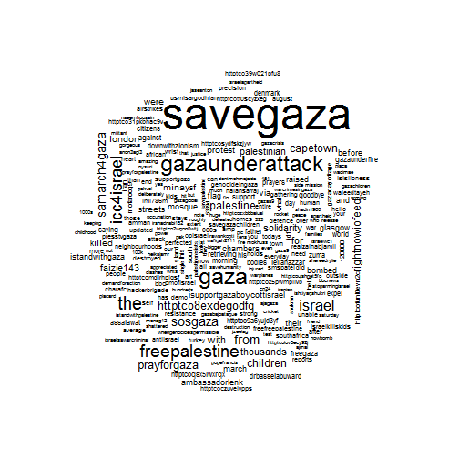

Twitter Text Mining in R | Mining Twitter with R
========================================================

In this document I use same data with in this link -> http://rischanlab.github.io/Retweet_Graph.html

For more information
#Setup your twitter account

see -> http://rischanlab.github.io/twitteR.html

After you setup your twitter account just try to get data with contain “SaveGaza”. But in this document I save the data first, because If I direct setup my twitter account in this document, knitr not supported because we have to input some code when we try to hand sake to Twitter API. please read the guide in link above to set up your twitter account in R. if you have error message “unautorized” Try to change the permission in your twitter application to “Read, write, and Direct Message”

#Load data 


```r
library(twitteR)
```

```
## Loading required package: ROAuth
## Loading required package: RCurl
## Loading required package: bitops
## Loading required package: digest
## Loading required package: rjson
```

```r
setwd("C:/Users/rischan/Dropbox/RESEARCH/rischanlab.github.io")
load("dm_tweets.Rdata")
head(dm_tweets,10)
```

```
## [[1]]
## [1] "bham_mz: @AbedaDocrat #CapeTown  #SAMarchForGaza #FreedomForPalestine #SaveGaza http://t.co/6mcKScccib"
## 
## [[2]]
## [1] "ahmedraei81: #GazaNeedsLOVE #GazaUnderAttack #ICC4Israel #ISupportGaza #FreePalestine #SaveGaza http://t.co/T1NxIbVoMP"
## 
## [[3]]
## [1] "Mgeze98: Ya Allah, protect Gaza and it's helpless civilians. 😭#SaveGaza #FreePalestine"
## 
## [[4]]
## [1] "LadyLayaa: Israeli warplanes kill more Palestinians in #Gaza #Palestine #SaveGaza #GazaUnderAttack\nhttp://t.co/bQEJRN0AKf http://t.co/M9CX07kCEy"
## 
## [[5]]
## [1] "FShiyaz: RT @rightnowio_feed: An Israeli protester holds a placard  against Israel's act... http://t.co/8ExDeGoDFQ #Sosgaza #Icc4israel #Savegaza #G…"
## 
## [[6]]
## [1] "Right2LeftUK: RT @mina_ysf: 3 were killed after Israel bombed a mosque before early morning prayers (retrieving their bodies) #SaveGaza http://t.co/OmJUl…"
## 
## [[7]]
## [1] "Samir_Latif: RT @DrBasselAbuward: Children of #Gaza VS Children of The World \n#ISupportGaza #prayforgaza #FreePalestine #SaveGaza #GazaUnderAttack http:…"
## 
## [[8]]
## [1] "redfrank1879: RT @PersonalEscrito: ‘Israel deliberately attacks #Gaza medics’ http://t.co/7h5bWGESN4 #ICC4Israel #IsraelIsAWarCriminal #BoycottIsrael #Fr…"
## 
## [[9]]
## [1] "jean_coonan: RT @rightnowio_feed: RT @mina_ysf: Human Rights Watch: Deliberately attacking... http://t.co/8ExDeGoDFQ #Sosgaza #Icc4israel #Savegaza #Gaz…"
## 
## [[10]]
## [1] "layansalloum: RT @raed_selmi: This pic via @wacima_e \nMy friend in London \n#FreePalestine\n#SaveGaza\n#AJAGAZA http://t.co/uJshneT5fO"
```

#Transforming Text


```r
df <- do.call("rbind", lapply(dm_tweets, as.data.frame))
dim(df)
```

```
## [1] 500  16
```

Load library text mining in R

```r
library(tm)
```

Transforming Text to Corpus

```r
myCorpus <- Corpus(VectorSource(df$text))
```

#Running standard text mining method -> changing letters to lower case, removing punctuations/numbers and removing stop words.


```r
myCorpus <- tm_map(myCorpus, tolower)
myCorpus <- tm_map(myCorpus, removePunctuation)
myCorpus <- tm_map(myCorpus, removePunctuation)
#in this case I just use standard stop word and adding three more stop word for giving example how to adding new stop word. If you have more stop word you can adding like that or try to save in one vector object.
myStopwords <- c(stopwords('english'), "and", "yes","no")
#removing word from stop word, for example in this case the word "Zion"
idx <- which(myStopwords == "zion")
myStopwords <- myStopwords[-idx]
myCorpus <- tm_map(myCorpus, removeWords, myStopwords)
```

#Stemming Words

```r
dictCorpus <- myCorpus
myCorpus <- tm_map(myCorpus, stemDocument)
inspect(myCorpus[1:3])
```

```
## A corpus with 3 text documents
## 
## The metadata consists of 2 tag-value pairs and a data frame
## Available tags are:
##   create_date creator 
## Available variables in the data frame are:
##   MetaID 
## 
## [[1]]
## abedadocrat capetown  samarchforgaza freedomforpalestin savegaza httptco6mckscccib
## 
## [[2]]
## gazaneedslov gazaunderattack icc4israel isupportgaza freepalestin savegaza httptcot1nxibvomp
## 
## [[3]]
## ya allah protect gaza and it helpless civilian í ísavegaza freepalestin
```

```r
myCorpus <- tm_map(myCorpus, stemCompletion, dictionary=dictCorpus)

#print again after completion
inspect(myCorpus[1:3])
```

```
## A corpus with 3 text documents
## 
## The metadata consists of 2 tag-value pairs and a data frame
## Available tags are:
##   create_date creator 
## Available variables in the data frame are:
##   MetaID 
## 
## [[1]]
## abedadocrat capetown samarchforgaza freedomforpalestine savegaza httptco6mckscccib
## 
## [[2]]
## gazaneedslove gazaunderattack icc4israel isupportgaza freepalestine savegaza httptcot1nxibvomp
## 
## [[3]]
## ya allah protect gaza and it helpless civilians í ísavegaza freepalestine
```
#Building a Document-Term Matrix

```r
myDtm <- TermDocumentMatrix(myCorpus, control = list(minWordLength = 1))
inspect(myDtm[266:270,31:40])
```

```
## A term-document matrix (5 terms, 10 documents)
## 
## Non-/sparse entries: 1/49
## Sparsity           : 98%
## Maximal term length: 8 
## Weighting          : term frequency (tf)
## 
##           Docs
## Terms      31 32 33 34 35 36 37 38 39 40
##   his       0  1  0  0  0  0  0  0  0  0
##   hit       0  0  0  0  0  0  0  0  0  0
##   holds     0  0  0  0  0  0  0  0  0  0
##   homeless  0  0  0  0  0  0  0  0  0  0
##   homes     0  0  0  0  0  0  0  0  0  0
```
#Frequent Terms and Associations

```r
findFreqTerms(myDtm, lowfreq=10)
```

```
##   [1] "000s"              "african"           "after"            
##   [4] "against"           "all"               "ambassadorlenk"   
##   [7] "amman"             "and"               "art"              
##  [10] "assalawat"         "average"           "bbc"              
##  [13] "before"            "bodies"            "bombed"           
##  [16] "boycottisrael"     "capetown"          "chambers"         
##  [19] "charafc"           "children"          "citizens"         
##  [22] "day"               "defence"           "denmark"          
##  [25] "downwithzionism"   "drbasselabuward"   "entire"           
##  [28] "expel"             "faizie143"         "father"           
##  [31] "flag"              "for"               "freegaza"         
##  [34] "freepalestine"     "from"              "gathering"        
##  [37] "gaza"              "gazadayofrage"     "gazaunderattack"  
##  [40] "gazaunderfire"     "glasgow"           "goodbye"          
##  [43] "has"               "his"               "httptco31pkbhac9v"
##  [46] "httptco8exdegodfq" "httptco9a6yujd3yf" "httptcofunt0evn2c"
##  [49] "httptcomdlrhplqsf" "httptcoqsx5iwxrqx" "icc4israel"       
##  [52] "idf"               "imi786m"           "iran"             
##  [55] "isislioness"       "israel"            "istandwithgaza"   
##  [58] "isupportgaza"      "killed"            "leilanazzar"      
##  [61] "london"            "march"             "minaysf"          
##  [64] "more"              "morning"           "mosque"           
##  [67] "nalansarraj"       "neighbourhoods"    "now"              
##  [70] "outside"           "palestine"         "palestinian"      
##  [73] "people"            "perfected"         "pmofisrael"       
##  [76] "prayers"           "prayforgaza"       "precision"        
##  [79] "presstvgaza"       "protest"           "raised"           
##  [82] "retrieving"        "rightnowiofeed"    "samarch4gaza"     
##  [85] "savegaza"          "savegazachildren"  "saying"           
##  [88] "self"              "solidarity"        "sosgaza"          
##  [91] "south"             "streets"           "strong"           
##  [94] "support"           "supportgaza"       "the"              
##  [97] "their"             "this"              "thousands"        
## [100] "todays"            "town"              "via"              
## [103] "war"               "were"              "with"             
## [106] "world"             "you"               "zuma"
```

```r
findAssocs(myDtm, 'zion', 0.30)
```

```
## $zion
## numeric(0)
```

```r
findAssocs(myDtm, 'Gaza', 0.30)
```

```
## $Gaza
## numeric(0)
```
#Building and Plotting Word Cloud

```r
library(wordcloud)
```

```
## Loading required package: Rcpp
## Loading required package: RColorBrewer
```

```
## Warning: package 'RColorBrewer' was built under R version 3.1.1
```

```r
m <- as.matrix(myDtm)
v <- sort(rowSums(m), decreasing=TRUE)
myNames <- names(v)
k <- which(names(v)=="Gaza")
myNames[k] <- "Palestine"
d <- data.frame(word=myNames, freq=v)
wordcloud(d$word, d$freq, min.freq=3)
```

 
