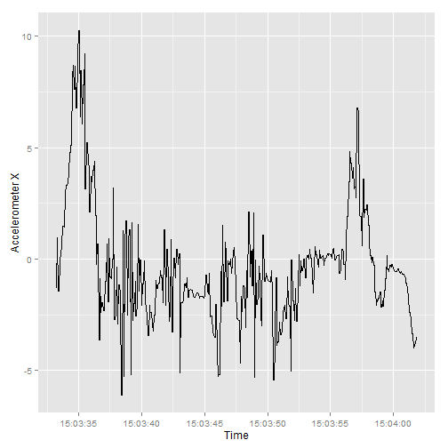
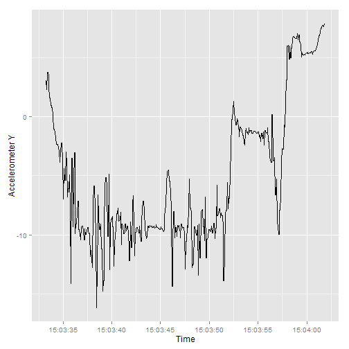
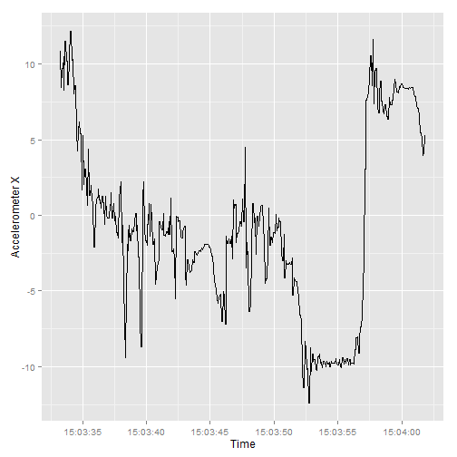

Accelerometer Plot Example
========================================================

Created by 

**Rischan Mafrur**

Chonnam National University of South Korea

August 6, 2014

```r
library(ggplot2)
```

```
## Warning: package 'ggplot2' was built under R version 3.1.1
```

```r
library(scales)

setwd('C:/Users/rischan/Dropbox/RESEARCH/magno/data/nexus/1_jalan_masuk_7_9')
setwd('C:/Users/rischan/Dropbox/RESEARCH/magno/data/note II/1_masuk_jalan_7_9')
acc <- read.csv(file="Sensor_record_20140709_150401_AndroSensor.csv")
```

Show the sample data

```r
head(acc)
```

```
##   ACCELEROMETER.X..m.s². ACCELEROMETER.Y..m.s². ACCELEROMETER.Z..m.s².
## 1                -1.33118                   3.036                  10.822
## 2                 0.93853                   2.327                   8.475
## 3                -1.43652                   3.764                   9.730
## 4                -1.43652                   3.764                   9.730
## 5                -0.04788                   3.505                  10.467
## 6                 0.18196                   2.614                   8.274
##   GRAVITY.X..m.s². GRAVITY.Y..m.s². GRAVITY.Z..m.s².
## 1           -0.9011             3.390             9.158
## 2           -0.3275             3.157             9.279
## 3           -0.5291             3.389             9.187
## 4           -0.5291             3.389             9.187
## 5           -0.3694             3.043             9.315
## 6           -0.3694             3.043             9.315
##   LINEAR.ACCELERATION.X..m.s². LINEAR.ACCELERATION.Y..m.s².
## 1                       0.01124                       -0.4447
## 2                       1.02908                       -1.0927
## 3                       1.02908                       -1.0927
## 4                       0.92815                       -0.1875
## 5                       0.92815                       -0.1875
## 6                      -0.07806                       -0.2525
##   LINEAR.ACCELERATION.Z..m.s². GYROSCOPE.X..rad.s. GYROSCOPE.Y..rad.s.
## 1                         1.384             -0.2605             -0.9490
## 2                        -1.353             -0.2605             -0.9490
## 3                        -1.353              0.3567              0.5238
## 4                         2.500              0.3567              0.5238
## 5                         2.500              0.5012             -0.4221
## 6                        -1.100              0.5012             -0.4221
##   GYROSCOPE.Z..rad.s. LIGHT..lux. MAGNETIC.FIELD.X..Î.T.
## 1              0.1811          20                  -8.76
## 2              0.1811          20                 -11.94
## 3             -0.6637          20                 -11.94
## 4             -0.6637          20                 -12.48
## 5             -0.5959          20                 -12.48
## 6             -0.5959           0                  -9.96
##   MAGNETIC.FIELD.Y..Î.T. MAGNETIC.FIELD.Z..Î.T. ORIENTATION.X..Â..
## 1                 -38.46                 -19.26              156.9
## 2                 -37.98                 -19.62              156.9
## 3                 -37.98                 -19.62              156.9
## 4                 -38.34                 -19.98              155.6
## 5                 -38.34                 -19.98              155.6
## 6                 -39.18                 -20.64              160.6
##   ORIENTATION.Y..Â.. ORIENTATION.Z..Â.. PROXIMITY..i. LOCATION.Latitude..
## 1             -22.28             10.159             8               35.18
## 2             -22.28             10.159             8               35.18
## 3             -22.28             10.159             8               35.18
## 4             -20.22              3.296             8               35.18
## 5             -20.22              3.296             8               35.18
## 6             -18.08              2.271             8               35.18
##   LOCATION.Longitude.. LOCATION.Accuracy...m. Temperature..F. Level....
## 1                126.9                  100.5            90.5        68
## 2                126.9                  100.5            90.5        68
## 3                126.9                  100.5            90.5        68
## 4                126.9                  100.5            90.5        68
## 5                126.9                  100.5            90.5        68
## 6                126.9                  100.5            90.5        68
##   Voltage..Volt. Time.since.start.in.ms YYYY.MO.DD.HH.MI.SS_SSS
## 1          3.882                     15 2014-07-09 15:03:33:252
## 2          3.882                     92 2014-07-09 15:03:33:329
## 3          3.882                    147 2014-07-09 15:03:33:384
## 4          3.882                    203 2014-07-09 15:03:33:440
## 5          3.882                    265 2014-07-09 15:03:33:502
## 6          3.882                    322 2014-07-09 15:03:33:559
```

Select the data which we only need it.

```r
dacc <- data.frame(acc$ACCELEROMETER.X..m.s².,acc$ACCELEROMETER.Y..m.s².,
                   acc$ACCELEROMETER.Z..m.s².,acc$MAGNETIC.FIELD.X..Î.T.,
                   acc$MAGNETIC.FIELD.Y..Î.T.,acc$MAGNETIC.FIELD.Z..Î.T.,
                   acc$YYYY.MO.DD.HH.MI.SS_SSS)

names(dacc) <- c("accX","accY","accZ","mX","mY","mZ","time")
```

show the new data "dacc"

```r
head(dacc,10)
```

```
##        accX   accY   accZ     mX     mY     mZ                    time
## 1  -1.33118 3.0358 10.822  -8.76 -38.46 -19.26 2014-07-09 15:03:33:252
## 2   0.93853 2.3272  8.475 -11.94 -37.98 -19.62 2014-07-09 15:03:33:329
## 3  -1.43652 3.7637  9.730 -11.94 -37.98 -19.62 2014-07-09 15:03:33:384
## 4  -1.43652 3.7637  9.730 -12.48 -38.34 -19.98 2014-07-09 15:03:33:440
## 5  -0.04788 3.5051 10.467 -12.48 -38.34 -19.98 2014-07-09 15:03:33:502
## 6   0.18196 2.6145  8.274  -9.96 -39.18 -20.64 2014-07-09 15:03:33:559
## 7   0.58418 1.5993 11.502  -9.96 -39.18 -20.64 2014-07-09 15:03:33:623
## 8   0.58418 1.5993 11.502 -10.14 -38.88 -22.98 2014-07-09 15:03:33:677
## 9   1.45568 0.9768 10.161 -10.14 -38.88 -22.98 2014-07-09 15:03:33:729
## 10  1.45568 0.9768 10.161 -15.30 -34.74 -29.04 2014-07-09 15:03:33:783
```

Before we plot the data we have to change the time format from factor to posixct, 

```r
class(dacc$time)
```

```
## [1] "factor"
```
Change to POSIXct format

```r
dacc$time <- strptime(gsub(":(?!\\d+:)", ".", as.character(dacc$time), perl=T), "%Y-%m-%d %H:%M:%OS")
```

Show class of data 

```r
class(dacc$time)
```

```
## [1] "POSIXlt" "POSIXt"
```

```r
head(dacc,10)
```

```
##        accX   accY   accZ     mX     mY     mZ                time
## 1  -1.33118 3.0358 10.822  -8.76 -38.46 -19.26 2014-07-09 15:03:33
## 2   0.93853 2.3272  8.475 -11.94 -37.98 -19.62 2014-07-09 15:03:33
## 3  -1.43652 3.7637  9.730 -11.94 -37.98 -19.62 2014-07-09 15:03:33
## 4  -1.43652 3.7637  9.730 -12.48 -38.34 -19.98 2014-07-09 15:03:33
## 5  -0.04788 3.5051 10.467 -12.48 -38.34 -19.98 2014-07-09 15:03:33
## 6   0.18196 2.6145  8.274  -9.96 -39.18 -20.64 2014-07-09 15:03:33
## 7   0.58418 1.5993 11.502  -9.96 -39.18 -20.64 2014-07-09 15:03:33
## 8   0.58418 1.5993 11.502 -10.14 -38.88 -22.98 2014-07-09 15:03:33
## 9   1.45568 0.9768 10.161 -10.14 -38.88 -22.98 2014-07-09 15:03:33
## 10  1.45568 0.9768 10.161 -15.30 -34.74 -29.04 2014-07-09 15:03:33
```

Now we can Plot it, in this document we use ggplot 

```r
p <- ggplot(dacc, aes(dacc$time, dacc$accX)) +
     geom_line() + scale_x_datetime(breaks=date_breaks("5 sec"), labels = date_format("%H:%M:%S")) + xlab("Time") +
     ylab("Accelerometer X")
p
```

 

```r
p <- ggplot(dacc, aes(dacc$time, dacc$accY)) +
     geom_line() + scale_x_datetime(breaks=date_breaks("5 sec"), labels = date_format("%H:%M:%S")) + xlab("Time") +
     ylab("Accelerometer Y")
p
```

 

```r
p <- ggplot(dacc, aes(dacc$time, dacc$accZ)) +
     geom_line() + scale_x_datetime(breaks=date_breaks("5 sec"), labels = date_format("%H:%M:%S")) + xlab("Time") +
     ylab("Accelerometer X")
p
```

 
