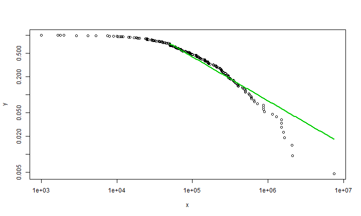

Power Law in R example
========================================================
In this document I just want to show how to plot the data which following power law distribution. 

Load power law library 

```r
library("poweRlaw")
```

```
## Warning: package 'poweRlaw' was built under R version 3.1.1
```


Read the data

```r
#knitr doesnt support for read.table using direct url
#blackouts = read.table("https://raw.githubusercontent.com/keflavich/plfit/master/plfit/tests/blackouts.txt")
#if you want to get this data you can accessit in my github, under rischanlab.github.io project
setwd("C:/Users/rischan/Dropbox/RESEARCH/rischanlab.github.io")
load("blackouts.Rdata")
```

Show example data

```r
head(blackouts)
```

```
##       V1
## 1 570000
## 2 210882
## 3 190000
## 4  46000
## 5  17000
## 6 360000
```

Run Power Law function 

```r
#Continuous power law objects take vectors as inputs,
m_bl = conpl$new(blackouts$V1)
#estimate the lower-bound
est = estimate_xmin(m_bl)
#update the distribution object
m_bl$setXmin(est)
```

Plot the data which following power law distribution 


```r
plot(m_bl)
lines(m_bl, col=2, lwd=2)
lines(m_bl, col=3, lwd=2)
```

 

