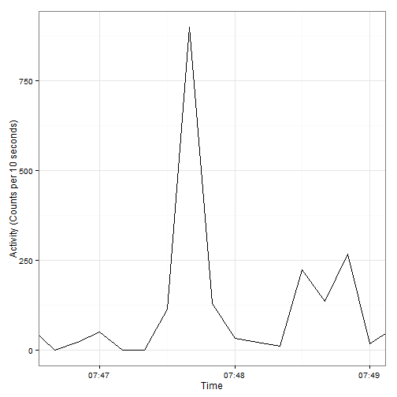

Plot Timeseries for each time [example]
========================================================
Create Data Frame


```r
day3 <- structure(list(Date = c("11/12/2012", "11/12/2012", "11/12/2012", 
                                "11/12/2012", "11/12/2012", "11/12/2012", "11/12/2012", "11/12/2012", 
                                "11/12/2012", "11/12/2012", "11/12/2012", "11/12/2012", "11/12/2012", 
                                "11/12/2012", "11/12/2012", "11/12/2012", "11/12/2012", "11/12/2012", 
                                "11/12/2012", "11/12/2012"), Time = c("07:46:10", "07:46:20", 
                                                                      "07:46:30", "07:46:40", "07:46:50", "07:47:00", "07:47:10", "07:47:20", 
                                                                      "07:47:30", "07:47:40", "07:47:50", "07:48:00", "07:48:10", "07:48:20", 
                                                                      "07:48:30", "07:48:40", "07:48:50", "07:49:00", "07:49:10", "07:49:20"
                                ), Axis1 = c(59L, 651L, 59L, 0L, 22L, 50L, 0L, 0L, 114L, 899L, 
                                             129L, 33L, 21L, 9L, 224L, 135L, 266L, 16L, 59L, 126L), Steps = c(1L, 
                                                                                                              2L, 1L, 0L, 2L, 1L, 0L, 0L, 5L, 15L, 6L, 2L, 2L, 0L, 8L, 5L, 
                                                                                                              16L, 1L, 3L, 8L)), .Names = c("Date", "Time", "Axis1", "Steps"
                                                                                                              ), row.names = 52838:52857, class = "data.frame")
```

The dataframe look like:


```r
day3
```

```
##             Date     Time Axis1 Steps
## 52838 11/12/2012 07:46:10    59     1
## 52839 11/12/2012 07:46:20   651     2
## 52840 11/12/2012 07:46:30    59     1
## 52841 11/12/2012 07:46:40     0     0
## 52842 11/12/2012 07:46:50    22     2
## 52843 11/12/2012 07:47:00    50     1
## 52844 11/12/2012 07:47:10     0     0
## 52845 11/12/2012 07:47:20     0     0
## 52846 11/12/2012 07:47:30   114     5
## 52847 11/12/2012 07:47:40   899    15
## 52848 11/12/2012 07:47:50   129     6
## 52849 11/12/2012 07:48:00    33     2
## 52850 11/12/2012 07:48:10    21     2
## 52851 11/12/2012 07:48:20     9     0
## 52852 11/12/2012 07:48:30   224     8
## 52853 11/12/2012 07:48:40   135     5
## 52854 11/12/2012 07:48:50   266    16
## 52855 11/12/2012 07:49:00    16     1
## 52856 11/12/2012 07:49:10    59     3
## 52857 11/12/2012 07:49:20   126     8
```
Plot :


```r
library(scales)
library(ggplot2)
```

```
## Warning: package 'ggplot2' was built under R version 3.1.1
```

```r
ggplot(day3, aes(x=strptime(Time, "%H:%M:%S"), y=Axis1)) + geom_line(aes(group = 1)) +
     theme_bw() +
     xlab("Time") + 
     ylab("Activity (Counts per 10 seconds)") +
     scale_x_datetime(limits=c(as.POSIXct("07:46:40",format="%H:%M:%S"),as.POSIXct("07:49:00",format="%H:%M:%S")),
                      breaks=date_breaks("1 min"), labels = date_format("%H:%M"))
```

 
